# 基于文件结构的数据库设计

根据完整的项目结构和业务需求，设计以下数据库表结构：

## 1. 用户相关表

```sql
-- 用户表
CREATE TABLE users (
    id BIGINT AUTO_INCREMENT PRIMARY KEY,
    username VARCHAR(50) UNIQUE NOT NULL,
    password VARCHAR(255) NOT NULL,
    email VARCHAR(100) UNIQUE NOT NULL,
    phone VARCHAR(20),
    status ENUM('ACTIVE', 'INACTIVE', 'LOCKED') DEFAULT 'ACTIVE',
    created_at TIMESTAMP DEFAULT CURRENT_TIMESTAMP,
    updated_at TIMESTAMP DEFAULT CURRENT_TIMESTAMP ON UPDATE CURRENT_TIMESTAMP,
    INDEX idx_username (username),
    INDEX idx_email (email),
    INDEX idx_phone (phone)
);

-- 用户资料表
CREATE TABLE user_profiles (
    id BIGINT AUTO_INCREMENT PRIMARY KEY,
    user_id BIGINT NOT NULL,
    real_name VARCHAR(100),
    id_card VARCHAR(18),
    address TEXT,
    avatar_url VARCHAR(255),
    birth_date DATE,
    gender ENUM('MALE', 'FEMALE', 'OTHER'),
    created_at TIMESTAMP DEFAULT CURRENT_TIMESTAMP,
    updated_at TIMESTAMP DEFAULT CURRENT_TIMESTAMP ON UPDATE CURRENT_TIMESTAMP,
    FOREIGN KEY (user_id) REFERENCES users(id) ON DELETE CASCADE,
    INDEX idx_user_id (user_id),
    INDEX idx_id_card (id_card)
);
```

## 2. 权限相关表

```sql
-- 权限表
CREATE TABLE permissions (
    id BIGINT AUTO_INCREMENT PRIMARY KEY,
    name VARCHAR(100) UNIQUE NOT NULL,
    description VARCHAR(255),
    type ENUM('MENU', 'BUTTON', 'API') NOT NULL,
    resource VARCHAR(255),
    parent_id BIGINT,
    sort_order INT DEFAULT 0,
    created_at TIMESTAMP DEFAULT CURRENT_TIMESTAMP,
    INDEX idx_name (name),
    INDEX idx_type (type),
    INDEX idx_parent_id (parent_id)
);

-- 角色表
CREATE TABLE roles (
    id BIGINT AUTO_INCREMENT PRIMARY KEY,
    name VARCHAR(50) UNIQUE NOT NULL,
    description VARCHAR(255),
    is_system BOOLEAN DEFAULT FALSE,
    created_at TIMESTAMP DEFAULT CURRENT_TIMESTAMP,
    updated_at TIMESTAMP DEFAULT CURRENT_TIMESTAMP ON UPDATE CURRENT_TIMESTAMP,
    INDEX idx_name (name)
);

-- 角色权限关联表
CREATE TABLE role_permissions (
    id BIGINT AUTO_INCREMENT PRIMARY KEY,
    role_id BIGINT NOT NULL,
    permission_id BIGINT NOT NULL,
    created_at TIMESTAMP DEFAULT CURRENT_TIMESTAMP,
    FOREIGN KEY (role_id) REFERENCES roles(id) ON DELETE CASCADE,
    FOREIGN KEY (permission_id) REFERENCES permissions(id) ON DELETE CASCADE,
    UNIQUE KEY uk_role_permission (role_id, permission_id)
);

-- 用户角色关联表
CREATE TABLE user_roles (
    id BIGINT AUTO_INCREMENT PRIMARY KEY,
    user_id BIGINT NOT NULL,
    role_id BIGINT NOT NULL,
    created_at TIMESTAMP DEFAULT CURRENT_TIMESTAMP,
    FOREIGN KEY (user_id) REFERENCES users(id) ON DELETE CASCADE,
    FOREIGN KEY (role_id) REFERENCES roles(id) ON DELETE CASCADE,
    UNIQUE KEY uk_user_role (user_id, role_id)
);
```

## 3. 认证相关表

```sql
-- 用户会话表
CREATE TABLE user_sessions (
    session_id VARCHAR(64) PRIMARY KEY,
    user_id BIGINT NOT NULL,
    device_info VARCHAR(255),
    login_time TIMESTAMP DEFAULT CURRENT_TIMESTAMP,
    last_access_time TIMESTAMP DEFAULT CURRENT_TIMESTAMP,
    ip_address VARCHAR(45),
    active BOOLEAN DEFAULT TRUE,
    expires_at TIMESTAMP,
    FOREIGN KEY (user_id) REFERENCES users(id) ON DELETE CASCADE,
    INDEX idx_user_id (user_id),
    INDEX idx_expires_at (expires_at)
);

-- 刷新令牌表
CREATE TABLE refresh_tokens (
    token VARCHAR(255) PRIMARY KEY,
    user_id BIGINT NOT NULL,
    expiry_date TIMESTAMP NOT NULL,
    revoked BOOLEAN DEFAULT FALSE,
    created_at TIMESTAMP DEFAULT CURRENT_TIMESTAMP,
    FOREIGN KEY (user_id) REFERENCES users(id) ON DELETE CASCADE,
    INDEX idx_user_id (user_id),
    INDEX idx_expiry_date (expiry_date)
);
```

## 4. 物品相关表

```sql
-- 物品分类表
CREATE TABLE item_categories (
    id BIGINT AUTO_INCREMENT PRIMARY KEY,
    name VARCHAR(100) NOT NULL,
    description TEXT,
    parent_id BIGINT,
    sort_order INT DEFAULT 0,
    created_at TIMESTAMP DEFAULT CURRENT_TIMESTAMP,
    updated_at TIMESTAMP DEFAULT CURRENT_TIMESTAMP ON UPDATE CURRENT_TIMESTAMP,
    INDEX idx_parent_id (parent_id),
    INDEX idx_name (name)
);

-- 物品表
CREATE TABLE items (
    id BIGINT AUTO_INCREMENT PRIMARY KEY,
    name VARCHAR(200) NOT NULL,
    description TEXT,
    category_id BIGINT,
    price_per_day DECIMAL(10, 2) NOT NULL,
    deposit DECIMAL(10, 2) DEFAULT 0,
    status ENUM('AVAILABLE', 'RENTED', 'MAINTENANCE', 'UNAVAILABLE') DEFAULT 'AVAILABLE',
    location VARCHAR(255),
    images JSON,
    specifications JSON,
    created_at TIMESTAMP DEFAULT CURRENT_TIMESTAMP,
    updated_at TIMESTAMP DEFAULT CURRENT_TIMESTAMP ON UPDATE CURRENT_TIMESTAMP,
    FOREIGN KEY (category_id) REFERENCES item_categories(id),
    INDEX idx_name (name),
    INDEX idx_category_id (category_id),
    INDEX idx_status (status),
    INDEX idx_price (price_per_day)
);
```

## 5. 订单相关表

```sql
-- 订单表
CREATE TABLE orders (
    id BIGINT AUTO_INCREMENT PRIMARY KEY,
    order_no VARCHAR(64) UNIQUE NOT NULL,
    user_id BIGINT NOT NULL,
    total_amount DECIMAL(12, 2) NOT NULL,
    deposit_amount DECIMAL(12, 2) DEFAULT 0,
    status ENUM('PENDING', 'CONFIRMED', 'PAID', 'IN_USE', 'RETURNED', 'CANCELLED') DEFAULT 'PENDING',
    start_date DATE NOT NULL,
    end_date DATE NOT NULL,
    actual_return_date DATE,
    remark TEXT,
    created_at TIMESTAMP DEFAULT CURRENT_TIMESTAMP,
    updated_at TIMESTAMP DEFAULT CURRENT_TIMESTAMP ON UPDATE CURRENT_TIMESTAMP,
    FOREIGN KEY (user_id) REFERENCES users(id),
    INDEX idx_order_no (order_no),
    INDEX idx_user_id (user_id),
    INDEX idx_status (status),
    INDEX idx_created_at (created_at)
);

-- 订单项表
CREATE TABLE order_items (
    id BIGINT AUTO_INCREMENT PRIMARY KEY,
    order_id BIGINT NOT NULL,
    item_id BIGINT NOT NULL,
    quantity INT NOT NULL DEFAULT 1,
    price_per_day DECIMAL(10, 2) NOT NULL,
    total_amount DECIMAL(12, 2) NOT NULL,
    created_at TIMESTAMP DEFAULT CURRENT_TIMESTAMP,
    FOREIGN KEY (order_id) REFERENCES orders(id) ON DELETE CASCADE,
    FOREIGN KEY (item_id) REFERENCES items(id),
    INDEX idx_order_id (order_id),
    INDEX idx_item_id (item_id)
);
```

## 6. 支付相关表

```sql
-- 支付表
CREATE TABLE payments (
    id BIGINT AUTO_INCREMENT PRIMARY KEY,
    payment_no VARCHAR(64) UNIQUE NOT NULL,
    order_id BIGINT NOT NULL,
    amount DECIMAL(12, 2) NOT NULL,
    payment_method ENUM('ALIPAY', 'WECHAT', 'CASH', 'BANK_TRANSFER') NOT NULL,
    payment_type ENUM('RENTAL', 'DEPOSIT', 'REFUND') NOT NULL,
    status ENUM('PENDING', 'SUCCESS', 'FAILED', 'CANCELLED') DEFAULT 'PENDING',
    third_party_transaction_id VARCHAR(255),
    created_at TIMESTAMP DEFAULT CURRENT_TIMESTAMP,
    updated_at TIMESTAMP DEFAULT CURRENT_TIMESTAMP ON UPDATE CURRENT_TIMESTAMP,
    FOREIGN KEY (order_id) REFERENCES orders(id),
    INDEX idx_payment_no (payment_no),
    INDEX idx_order_id (order_id),
    INDEX idx_status (status),
    INDEX idx_created_at (created_at)
);

-- 支付记录表
CREATE TABLE payment_records (
    id BIGINT AUTO_INCREMENT PRIMARY KEY,
    payment_id BIGINT NOT NULL,
    status ENUM('PENDING', 'SUCCESS', 'FAILED', 'CANCELLED') NOT NULL,
    response_data JSON,
    error_message TEXT,
    created_at TIMESTAMP DEFAULT CURRENT_TIMESTAMP,
    FOREIGN KEY (payment_id) REFERENCES payments(id) ON DELETE CASCADE,
    INDEX idx_payment_id (payment_id),
    INDEX idx_status (status)
);
```

## 7. 合同相关表

```sql
-- 合同模板表
CREATE TABLE contract_templates (
    id BIGINT AUTO_INCREMENT PRIMARY KEY,
    name VARCHAR(200) NOT NULL,
    content TEXT NOT NULL,
    version VARCHAR(20) DEFAULT '1.0',
    is_active BOOLEAN DEFAULT TRUE,
    created_at TIMESTAMP DEFAULT CURRENT_TIMESTAMP,
    updated_at TIMESTAMP DEFAULT CURRENT_TIMESTAMP ON UPDATE CURRENT_TIMESTAMP,
    INDEX idx_name (name),
    INDEX idx_is_active (is_active)
);

-- 合同表
CREATE TABLE contracts (
    id BIGINT AUTO_INCREMENT PRIMARY KEY,
    contract_no VARCHAR(64) UNIQUE NOT NULL,
    order_id BIGINT NOT NULL,
    template_id BIGINT,
    content TEXT NOT NULL,
    status ENUM('DRAFT', 'SIGNED', 'EXPIRED', 'TERMINATED') DEFAULT 'DRAFT',
    signed_at TIMESTAMP NULL,
    expires_at TIMESTAMP NULL,
    created_at TIMESTAMP DEFAULT CURRENT_TIMESTAMP,
    updated_at TIMESTAMP DEFAULT CURRENT_TIMESTAMP ON UPDATE CURRENT_TIMESTAMP,
    FOREIGN KEY (order_id) REFERENCES orders(id),
    FOREIGN KEY (template_id) REFERENCES contract_templates(id),
    INDEX idx_contract_no (contract_no),
    INDEX idx_order_id (order_id),
    INDEX idx_status (status)
);
```

## 8. 财务相关表

```sql
-- 财务记录表
CREATE TABLE finance_records (
    id BIGINT AUTO_INCREMENT PRIMARY KEY,
    record_no VARCHAR(64) UNIQUE NOT NULL,
    order_id BIGINT,
    payment_id BIGINT,
    type ENUM('INCOME', 'EXPENSE', 'REFUND') NOT NULL,
    category VARCHAR(100) NOT NULL,
    amount DECIMAL(12, 2) NOT NULL,
    description TEXT,
    created_at TIMESTAMP DEFAULT CURRENT_TIMESTAMP,
    FOREIGN KEY (order_id) REFERENCES orders(id),
    FOREIGN KEY (payment_id) REFERENCES payments(id),
    INDEX idx_record_no (record_no),
    INDEX idx_type (type),
    INDEX idx_category (category),
    INDEX idx_created_at (created_at)
);

-- 财务报表表
CREATE TABLE finance_reports (
    id BIGINT AUTO_INCREMENT PRIMARY KEY,
    report_type ENUM('DAILY', 'WEEKLY', 'MONTHLY', 'YEARLY') NOT NULL,
    period_start DATE NOT NULL,
    period_end DATE NOT NULL,
    total_income DECIMAL(15, 2) DEFAULT 0,
    total_expense DECIMAL(15, 2) DEFAULT 0,
    net_profit DECIMAL(15, 2) DEFAULT 0,
    report_data JSON,
    created_at TIMESTAMP DEFAULT CURRENT_TIMESTAMP,
    INDEX idx_report_type (report_type),
    INDEX idx_period (period_start, period_end)
);
```

## 9. 通知相关表

```sql
-- 通知表
CREATE TABLE notifications (
    id BIGINT AUTO_INCREMENT PRIMARY KEY,
    user_id BIGINT NOT NULL,
    type ENUM('EMAIL', 'SMS', 'SYSTEM') NOT NULL,
    title VARCHAR(255) NOT NULL,
    content TEXT NOT NULL,
    status ENUM('PENDING', 'SENT', 'FAILED', 'READ') DEFAULT 'PENDING',
    sent_at TIMESTAMP NULL,
    read_at TIMESTAMP NULL,
    created_at TIMESTAMP DEFAULT CURRENT_TIMESTAMP,
    FOREIGN KEY (user_id) REFERENCES users(id),
    INDEX idx_user_id (user_id),
    INDEX idx_type (type),
    INDEX idx_status (status),
    INDEX idx_created_at (created_at)
);
```

## 10. 初始化数据

```sql
-- 初始化系统权限
INSERT INTO permissions (name, description, type, resource) VALUES
('USER_VIEW', '查看用户', 'API', '/api/users/**'),
('USER_CREATE', '创建用户', 'API', '/api/users'),
('USER_UPDATE', '更新用户', 'API', '/api/users/**'),
('USER_DELETE', '删除用户', 'API', '/api/users/**'),
('ITEM_VIEW', '查看物品', 'API', '/api/items/**'),
('ITEM_CREATE', '创建物品', 'API', '/api/items'),
('ITEM_UPDATE', '更新物品', 'API', '/api/items/**'),
('ITEM_DELETE', '删除物品', 'API', '/api/items/**'),
('ORDER_VIEW', '查看订单', 'API', '/api/orders/**'),
('ORDER_CREATE', '创建订单', 'API', '/api/orders'),
('ORDER_UPDATE', '更新订单', 'API', '/api/orders/**'),
('ORDER_CANCEL', '取消订单', 'API', '/api/orders/*/cancel'),
('PAYMENT_VIEW', '查看支付', 'API', '/api/payments/**'),
('PAYMENT_MANAGE', '管理支付', 'API', '/api/payments/**'),
('FINANCE_VIEW', '查看财务', 'API', '/api/finance/**'),
('FINANCE_MANAGE', '管理财务', 'API', '/api/finance/**');

-- 初始化系统角色
INSERT INTO roles (name, description, is_system) VALUES
('ADMIN', '系统管理员', true),
('MANAGER', '业务经理', true),
('OPERATOR', '操作员', true),
('CUSTOMER', '客户', true);

-- 初始化管理员用户
INSERT INTO users (username, password, email, status) VALUES
('admin', '$2a$10$N.zmdr9k7uOCQb376NoUnuTJ8iAt6Z5EHsM8lE9P4yPGEWNVfHEIS', 'admin@rental.com', 'ACTIVE');

-- 分配管理员角色
INSERT INTO user_roles (user_id, role_id) VALUES
(1, 1);

-- 为管理员角色分配所有权限
INSERT INTO role_permissions (role_id, permission_id) 
SELECT 1, id FROM permissions;

-- 初始化物品分类
INSERT INTO item_categories (name, description) VALUES
('电子设备', '各类电子设备租赁'),
('家具家电', '家具和家电设备'),
('工具设备', '各类工具和设备'),
('运动器材', '体育运动相关器材'),
('交通工具', '各类交通工具');
```

## 数据库设计特点

1. **完整的权限体系**：用户-角色-权限三层关系，支持细粒度权限控制
2. **支付集成支持**：支持多种支付方式和支付状态跟踪
3. **订单流程完整**：从创建到归还的完整订单生命周期
4. **财务管理**：详细的财务记录和报表功能
5. **安全性考虑**：会话管理、令牌管理等安全机制
6. **扩展性良好**：使用JSON字段存储动态数据，便于扩展
7. **索引优化**：针对常用查询字段建立索引，提高查询性能

该数据库设计与项目文件结构完全对应，支持所有业务模块的功能需求。

```mermaid
erDiagram
    %% 用户相关表
    users {
        bigint id PK
        varchar username UK
        varchar password
        varchar email UK
        varchar phone
        enum status
        timestamp created_at
        timestamp updated_at
    }
    
    user_profiles {
        bigint id PK
        bigint user_id FK
        varchar real_name
        varchar id_card
        text address
        varchar avatar_url
        date birth_date
        enum gender
        timestamp created_at
        timestamp updated_at
    }
    
    %% 权限相关表
    permissions {
        bigint id PK
        varchar name UK
        varchar description
        enum type
        varchar resource
        bigint parent_id FK
        int sort_order
        timestamp created_at
    }
    
    roles {
        bigint id PK
        varchar name UK
        varchar description
        boolean is_system
        timestamp created_at
        timestamp updated_at
    }
    
    role_permissions {
        bigint id PK
        bigint role_id FK
        bigint permission_id FK
        timestamp created_at
    }
    
    user_roles {
        bigint id PK
        bigint user_id FK
        bigint role_id FK
        timestamp created_at
    }
    
    %% 认证相关表
    user_sessions {
        varchar session_id PK
        bigint user_id FK
        varchar device_info
        timestamp login_time
        timestamp last_access_time
        varchar ip_address
        boolean active
        timestamp expires_at
    }
    
    refresh_tokens {
        varchar token PK
        bigint user_id FK
        timestamp expiry_date
        boolean revoked
        timestamp created_at
    }
    
    %% 物品相关表
    item_categories {
        bigint id PK
        varchar name
        text description
        bigint parent_id FK
        int sort_order
        timestamp created_at
        timestamp updated_at
    }
    
    items {
        bigint id PK
        varchar name
        text description
        bigint category_id FK
        decimal price_per_day
        decimal deposit
        enum status
        varchar location
        json images
        json specifications
        timestamp created_at
        timestamp updated_at
    }
    
    %% 订单相关表
    orders {
        bigint id PK
        varchar order_no UK
        bigint user_id FK
        decimal total_amount
        decimal deposit_amount
        enum status
        date start_date
        date end_date
        date actual_return_date
        text remark
        timestamp created_at
        timestamp updated_at
    }
    
    order_items {
        bigint id PK
        bigint order_id FK
        bigint item_id FK
        int quantity
        decimal price_per_day
        decimal total_amount
        timestamp created_at
    }
    
    %% 支付相关表
    payments {
        bigint id PK
        varchar payment_no UK
        bigint order_id FK
        decimal amount
        enum payment_method
        enum payment_type
        enum status
        varchar third_party_transaction_id
        timestamp created_at
        timestamp updated_at
    }
    
    payment_records {
        bigint id PK
        bigint payment_id FK
        enum status
        json response_data
        text error_message
        timestamp created_at
    }
    
    %% 合同相关表
    contract_templates {
        bigint id PK
        varchar name
        text content
        varchar version
        boolean is_active
        timestamp created_at
        timestamp updated_at
    }
    
    contracts {
        bigint id PK
        varchar contract_no UK
        bigint order_id FK
        bigint template_id FK
        text content
        enum status
        timestamp signed_at
        timestamp expires_at
        timestamp created_at
        timestamp updated_at
    }
    
    %% 财务相关表
    finance_records {
        bigint id PK
        varchar record_no UK
        bigint order_id FK
        bigint payment_id FK
        enum type
        varchar category
        decimal amount
        text description
        timestamp created_at
    }
    
    finance_reports {
        bigint id PK
        enum report_type
        date period_start
        date period_end
        decimal total_income
        decimal total_expense
        decimal net_profit
        json report_data
        timestamp created_at
    }
    
    %% 通知相关表
    notifications {
        bigint id PK
        bigint user_id FK
        enum type
        varchar title
        text content
        enum status
        timestamp sent_at
        timestamp read_at
        timestamp created_at
    }
    
    %% 关系定义
    users ||--o{ user_profiles : "has"
    users ||--o{ user_roles : "has"
    users ||--o{ user_sessions : "has"
    users ||--o{ refresh_tokens : "has"
    users ||--o{ orders : "creates"
    users ||--o{ notifications : "receives"
    
    roles ||--o{ role_permissions : "has"
    roles ||--o{ user_roles : "assigned_to"
    
    permissions ||--o{ role_permissions : "assigned_to"
    permissions ||--o{ permissions : "parent"
    
    item_categories ||--o{ items : "contains"
    item_categories ||--o{ item_categories : "parent"
    
    items ||--o{ order_items : "rented_in"
    
    orders ||--o{ order_items : "contains"
    orders ||--o{ payments : "has"
    orders ||--o{ contracts : "has"
    orders ||--o{ finance_records : "generates"
    
    payments ||--o{ payment_records : "tracks"
    payments ||--o{ finance_records : "records"
    
    contract_templates ||--o{ contracts : "uses"
```


